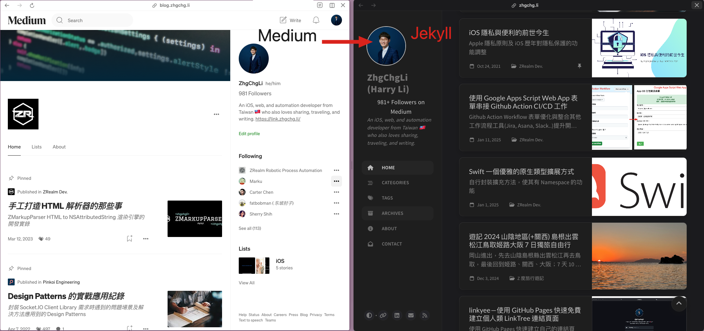

# [Medium To Jekyll Starter](https://github.com/ZhgChgLi/medium-to-jekyll-starter.github.io) (based on Chirpy Starter and ZMediumToMarkdown)

This project enables you to effortlessly and quickly create a mirrored content site for your Medium blog.

Automatically syncs your Medium posts, retrieves all content (including images and embedded code snippets), converts them to Markdown, and serves them as a static website using Jekyll with the Chirpy theme on GitHub Pages.

It’s user-friendly, stable, completely free, and requires a one-time setup for lifetime service.

## Live Demo

- [https://zhgchg.li/](https://zhgchg.li/)
- [https://github.com/ZhgChgLi/zhgchgli.github.io](https://github.com/ZhgChgLi/zhgchgli.github.io)

## Powered by
- [Jekyll](https://jekyllrb.com/)
- [Chirpy Jekyll Theme](https://github.com/cotes2020/jekyll-theme-chirpy/) v7.x
- [ZMediumToMarkdown](https://github.com/ZhgChgLi/ZMediumToMarkdown) Latest

## Usage

Check out the [docs](https://zhgchg.li/posts/en-medium-to-jekyll/).

## Buy me a coffee ❤️❤️❤️

[**If this project has helped you, feel free to sponsor me a cup of coffee, thank you.**](https://www.buymeacoffee.com/zhgchgli)

## Other works

### Integration Tools
- [ZReviewTender](https://github.com/ZhgChgLi/ZReviewTender) is a tool for fetching app reviews from the App Store and Google Play Console and integrating them into your workflow.
- [ZMediumToMarkdown](https://github.com/ZhgChgLi/ZMediumToMarkdown) is a powerful tool that allows you to effortlessly download and convert your Medium posts to Markdown format.
- [linkyee](https://github.com/ZhgChgLi/linkyee) is a fully customized, open-source LinkTree alternative deployed directly on GitHub Pages.
